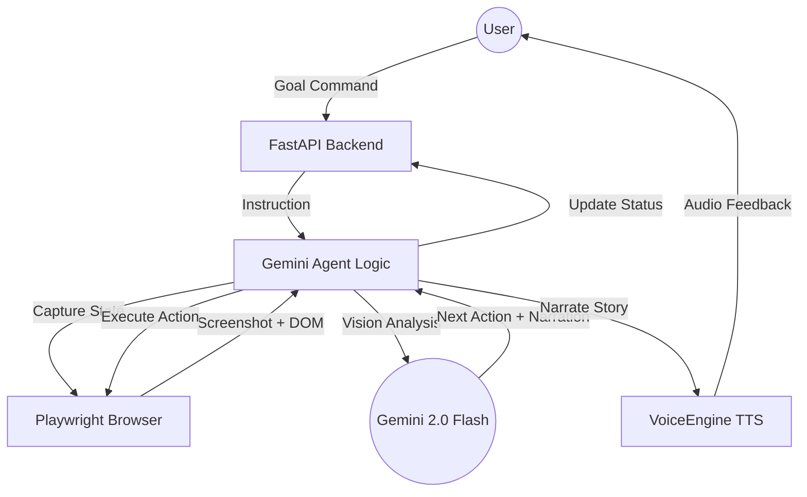

# SilverSurfer Architecture

### Deployment (Google Cloud):
The SilverSurfer backend is designed for containerized deployment on **Google Cloud GKE** or **Cloud Run**:
1. **Containerization**: Packaged via the provided `Dockerfile`.
2. **Orchestration**: Managed by Cloud Run for auto-scaling based on user requests.
3. **Storage**: Environment variables (API Keys) managed via **Secret Manager**.
4. **Networking**: Served over HTTPS with global load balancing for low-latency voice feedback.

